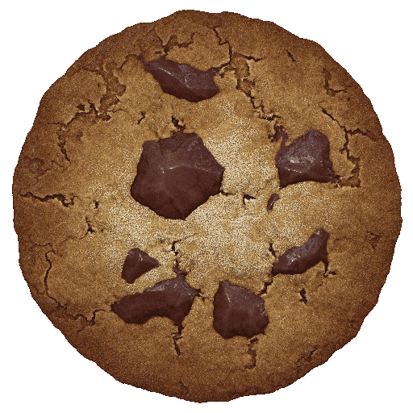

# Cookie Clicker for macOS

The original game can be found at http://orteil.dashnet.org/cookieclicker/

This is a macOS build of Cookie Clicker made using electron, forked from ozh's repo (http://ozh.github.io/cookieclicker/)

### How to update

App icon source: https://macosicons.com/#/?icon=0PLCMxMixJ

If the original game updates, here is how you can update the mirror:

#### 1. Fetch all new images :

From the root,

* `cd game/assets/images/`
* `wget --convert-links -O index.html http://orteil.dashnet.org/cookieclicker/img/`
* `grep -v PARENTDIR index.html | grep '\[IMG' | grep -Po 'a href="\K.*?(?=")' | sed 's/\?.*//' > _imglist.txt`
* `wget -N -i _imglist.txt -B http://orteil.dashnet.org/cookieclicker/img/`

#### 2. Fetch all new sounds :

Similarly, from the root :

* `cd game/assets/sounds/`
* `wget --convert-links -O index.html http://orteil.dashnet.org/cookieclicker/snd/`
* `grep -v PARENTDIR index.html | grep '\[SND' | grep -Po 'a href="\K.*?(?=")' | sed 's/\?.*//' > _sndlist.txt`
* `wget -N -i _sndlist.txt -B http://orteil.dashnet.org/cookieclicker/snd/`

#### 3. Fetch all new translations :

Similarly, from the root :

* `cd game/locales/`
* `wget --convert-links -O index.html http://orteil.dashnet.org/cookieclicker/loc/`
* `grep -v PARENTDIR index.html | grep '\[TXT' | grep -Po 'a href="\K.*?(?=")' | sed 's/\?.*//' > _loclist.txt`
* `wget -N -i _loclist.txt -B http://orteil.dashnet.org/cookieclicker/loc/`

#### 4. Update `js` and `html` files :

From the root directory :

* Fetch the updated `index.html` file: `wget -O game/index.html http://orteil.dashnet.org/cookieclicker/` 
* Fetch the updated `style.css` file: `wget -O game/style.css http://orteil.dashnet.org/cookieclicker/style.css`
* Fetch updated `js` files : `cd game && wget -N -i ../update/jslist.txt -B http://orteil.dashnet.org/cookieclicker/`
* Scan `index.html` for any new `<script src` and also `main.js` for any new local javascript (eg `Game.last.minigameUrl`). If there are new scripts, update the `update/jslist.txt` accordingly.